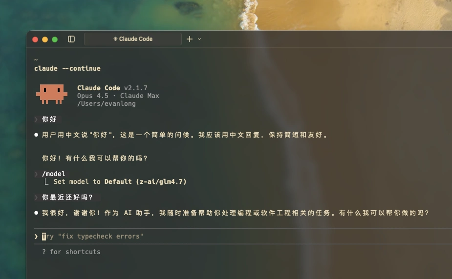

# NVIDIA Anthropic Proxy

[中文文档](README_CN.md)

A Cloudflare Worker proxy that enables Claude Code to use NVIDIA NIM API models.

- Use NVIDIA NIM open-source models (Llama, Minimax, GLM, etc.) in Claude Code
- Seamless model switching with full Claude Code experience
- Low-latency access via Cloudflare's global edge network



## Quick Start

### 1. Deploy the Proxy

```bash
git clone https://github.com/evanlong-me/nvidia-anthropic-proxy.git
cd nvidia-anthropic-proxy
npm run setup
npm run deploy
```

Setup will prompt for:
- **Cloudflare Account ID** - Found in [Cloudflare Dashboard](https://dash.cloudflare.com) sidebar
- **NVIDIA API Key** - Get it from [build.nvidia.com](https://build.nvidia.com)

After deployment, you'll get a Worker URL: `https://nvidia-anthropic-proxy.xxx.workers.dev`

### 2. Configure Claude Code

Edit `~/.claude/settings.json`:

```json
{
  "env": {
    "ANTHROPIC_BASE_URL": "https://nvidia-anthropic-proxy.xxx.workers.dev",
    "ANTHROPIC_DEFAULT_OPUS_MODEL": "minimaxai/minimax-m2.1",
    "ANTHROPIC_DEFAULT_SONNET_MODEL": "minimaxai/minimax-m2.1",
    "ANTHROPIC_DEFAULT_HAIKU_MODEL": "z-ai/glm4.7"
  }
}
```

### 3. Start Using

```bash
claude
```

- `/model opus` → minimaxai/minimax-m2.1
- `/model sonnet` → minimaxai/minimax-m2.1
- `/model haiku` → z-ai/glm4.7

## Supported Models

The proxy uses pass-through mode, supporting all NVIDIA NIM models:

| Model | Description |
|-------|-------------|
| `minimaxai/minimax-m2.1` | Minimax latest, strong Chinese capability |
| `z-ai/glm4.7` | Zhipu GLM4, fast response |
| `meta/llama-3.3-70b-instruct` | Meta Llama 3.3 70B |
| `meta/llama-3.1-405b-instruct` | Meta Llama 3.1 405B |
| `deepseek-ai/deepseek-r1` | DeepSeek R1 reasoning model |
| `qwen/qwen2.5-72b-instruct` | Alibaba Qwen 2.5 |

Full list: [build.nvidia.com/models](https://build.nvidia.com/models)

## How It Works

```
Claude Code (Anthropic format)
    ↓
This Proxy (Cloudflare Worker)
    ↓
Format Conversion (Anthropic → OpenAI)
    ↓
NVIDIA NIM API
```

## Local Development

```bash
npm run dev   # Start local server
npm run tail  # View real-time logs
```

## Star History

[](https://star-history.com/#evanlong-me/nvidia-anthropic-proxy&Date)

## License

MIT
